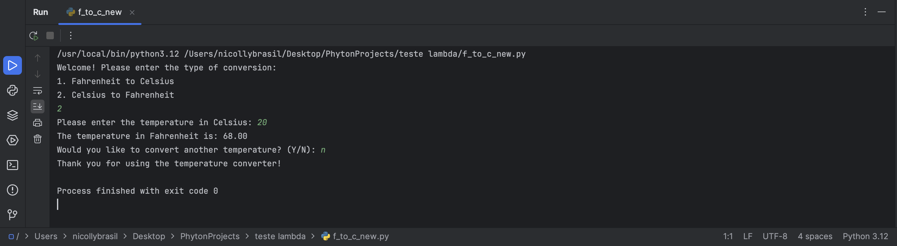

# Temperature Conversion Project!

Course learn phyton 3 by CodeCademy. 

Temperature conversion program that allows the user to convert between Fahrenheit and Celsius.

## Lessons

- Phyton
- Functions
- Loops
- Programming Logic

## Demonstration

